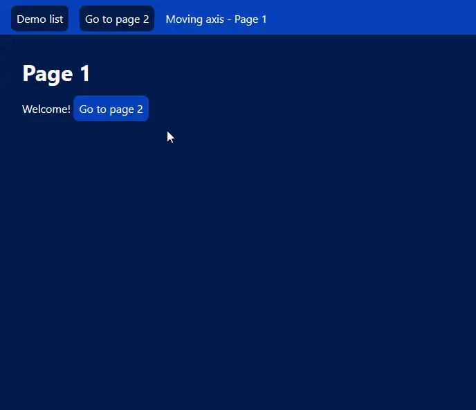

# View Transitions API polyfill

A polyfill for the [View Transitions API](https://drafts.csswg.org/css-view-transitions/).

The polyfill is [available on NPM](https://www.npmjs.com/package/view-transitions-polyfill).

**Star this repo ⭐ on GitHub if you found it helpful!**

## Demo

View some [demos showing example transitions](https://demarketed.github.io/view-transitions-polyfill/).



## Installation

### Using npm

Install the polyfill in your project from [npm](https://www.npmjs.com/package/view-transitions-polyfill):

```
npm install view-transitions-polyfill
```

### Plain JS file

You may also download the polyfill's pre-built JS file from:

- [Download version 1.0.5](https://github.com/demarketed/view-transitions-polyfill/releases/download/1.0.5/view-transitions-polyfill.js) (obtained from the [latest GitHub release](https://github.com/demarketed/view-transitions-polyfill/releases/tag/1.0.5))

### jsDelivr CDN

Get the polyfill from from [jsDelivr](https://www.jsdelivr.com/):

- Version 1.0.5: [https://cdn.jsdelivr.net/npm/view-transitions-polyfill@1.0.5](https://cdn.jsdelivr.net/npm/view-transitions-polyfill@1.0.5)
- Latest version: [https://cdn.jsdelivr.net/npm/view-transitions-polyfill](https://cdn.jsdelivr.net/npm/view-transitions-polyfill)

## Usage

Import the module into your site.

Inside a script (make sure it has `type="module"` in the `<script>` tag):

```js
import 'view-transitions-polyfill';
```

Or from the HTML:

```html
<script src="view-transitions-polyfill" async></script>

<!-- If the above does not work, try: -->
<script type="module">
  import 'view-transitions-polyfill';
</script>
```

> [!NOTE]  
> Change the URLs in the above code snippets according to your use case.
>
> - Import from npm: `view-transitions-polyfill`
> - Import from plain JS file: `./view-transitions-polyfill.js` (point it to the correct path for you)
> - Import from jsDelivr (version 1.0.5): `https://cdn.jsdelivr.net/npm/view-transitions-polyfill@1.0.5`

### Conditional loading

The above code snippets will always download the polyfill, whether the browser needs it or not. In order to only download the polyfill when needed, use the following code snippets.

Inside a script (make sure it has `type="module"` in the `<script>` tag):

```js
if (!document.startViewTransition) {
  import('view-transitions-polyfill');
}
```

Or from the HTML:

```html
<script type="module">
  if (!document.startViewTransition) {
    import('view-transitions-polyfill');
  }
</script>
```

> [!NOTE]  
> Change the URLs in the above code snippets according to your use case.
>
> - Import from npm: `view-transitions-polyfill`
> - Import from plain JS file: `./view-transitions-polyfill.js` (point it to the correct path for you)
> - Import from jsDelivr (version 1.0.5): `https://cdn.jsdelivr.net/npm/view-transitions-polyfill@1.0.5`

### With Astro View Transitions

You can use the polyfill with [Astro view transitions](https://docs.astro.build/en/guides/view-transitions/) by importing the script in the document as you would normally. For example, within a component:

```html
<script src="view-transitions-polyfill"></script>
```

## Compatibility

According to data from [Can I use](https://caniuse.com/es6,web-animation,mdn-css_selectors_where,shadowdomv1,mdn-api_customelementregistry,requestanimationframe), the polyfill should be fully supported on:

- Chrome ≥ 88
- Edge ≥ 88
- Opera ≥ 74
- Safari ≥ 14
- Firefox ≥ 78

This is because the polyfill currently requires the browser to support these notable features:

- [Element.animate()](https://developer.mozilla.org/en-US/docs/Web/API/Element/animate)
- [Document.getAnimations()](https://developer.mozilla.org/en-US/docs/Web/API/Document/getAnimations)
- [requestAnimationFrame()](https://developer.mozilla.org/en-US/docs/Web/API/Window/requestAnimationFrame)
- Custom elements
- Shadow DOM
- [CSS :where() selector](https://developer.mozilla.org/en-US/docs/Web/CSS/:where)

## Development

### Building

Build the polyfill to `dist`:

```
npm run build
```

### Testing

To test the polyfill, you can run [Web Platform Tests](https://web-platform-tests.org/index.html).
You need to [set up your system](https://web-platform-tests.org/running-tests/from-local-system.html) before running tests.

Run the tests with:

```
npm run test
```

This will generate report files in `test/report`.

The polyfill only loads its functions into the browser if it does not already natively support the View Transitions API.
You can run the tests with a version of the polyfill that avoids this check with:

```
npm run test-always-polyfill
```

You can view the tests' web pages in your browser with:

```
npm run test-debug
```

### Performance measurement

A version of the polyfill set up to measure its performance can be found at the [performance branch](https://github.com/demarketed/view-transitions-polyfill/tree/performance). You can follow the [associated instructions](https://github.com/demarketed/view-transitions-polyfill/tree/performance#performance-measurement).
