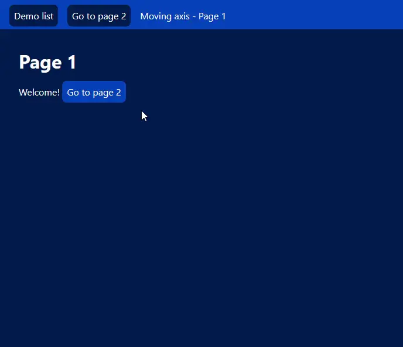

# View Transitions API polyfill

A polyfill for the [View Transitions API](https://drafts.csswg.org/css-view-transitions/).

The polyfill is [available on NPM](https://www.npmjs.com/package/view-transitions-polyfill).

**Star this repo ⭐ on GitHub if you found it helpful!**

## Performance measurement

This branch is designed to help with measuring the performance of the polyfill's various components.

How you can use it with your web page:

1. Clone the repo checkout this branch:

```
git clone https://github.com/demarketed/view-transitions-polyfill.git
cd view-transitions-polyfill
git checkout performance
```

2. Build the polyfill:

```
npm install
npm run build
```

3. Link this package:

```
npm link
```

4. Link it to your web page:

```
cd <the directory with your web page project>
npm link view-transitions-polyfill
```

5. Start hosting your web page locally.

Now test the performance of the polyfill in Firefox:

1. Go to your local web page.
2. Open Firefox DevTools and go to the _Performance_ tab to access the Firefox Profiler.
3. Start recording, then initiate a view transition on your page, then stop recording.

Inspect the performance of the steps of the transition:

1. Click on the _localhost_ track in the top half of the window.
2. Click on the _Marker Table_ tab in the bottom half of the window if you're unsure which tab to click.
3. Type _UserTiming_ in the search bar to filter the performance markers. This will make it so that only the polyfill's performance markers are shown.

You will now see the durations for each phase of the transition.

## Demo

View some [demos showing example transitions](https://demarketed.github.io/view-transitions-polyfill/).



## Installation

Install the polyfill in your project from [NPM](https://www.npmjs.com/package/view-transitions-polyfill):

```
npm install view-transitions-polyfill
```

## Usage

Import the module into your site.

Inside a script:

```js
import 'view-transitions-polyfill';
```

Or from the HTML:

```html
<script type="module">
  import 'view-transitions-polyfill';
</script>
```

### With Astro View Transitions

You can use the polyfill with [Astro view transitions](https://docs.astro.build/en/guides/view-transitions/) by importing the script in the document as you would normally. For example, within a component:

```html
<script src="view-transitions-polyfill"></script>
```

## Compatibility

According to data from [Can I use](https://caniuse.com/es6,web-animation,mdn-css_selectors_where,shadowdomv1,mdn-api_customelementregistry,requestanimationframe), the polyfill should be fully supported on:

- Chrome ≥ 88
- Edge ≥ 88
- Opera ≥ 74
- Safari ≥ 14
- Firefox ≥ 78

This is because the polyfill currently requires the browser to support these notable features:

- [Element.animate()](https://developer.mozilla.org/en-US/docs/Web/API/Element/animate)
- [Document.getAnimations()](https://developer.mozilla.org/en-US/docs/Web/API/Document/getAnimations)
- [requestAnimationFrame()](https://developer.mozilla.org/en-US/docs/Web/API/Window/requestAnimationFrame)
- Custom elements
- Shadow DOM
- [CSS :where() selector](https://developer.mozilla.org/en-US/docs/Web/CSS/:where)

## Development

### Building

Build the polyfill to `dist`:

```
npm run build
```

### Testing

To test the polyfill, you can run [Web Platform Tests](https://web-platform-tests.org/index.html).
You need to [set up your system](https://web-platform-tests.org/running-tests/from-local-system.html) before running tests.

Run the tests with:

```
npm run test
```

This will generate report files in `test/report`.

The polyfill only loads its functions into the browser if it does not already natively support the View Transitions API.
You can run the tests with a version of the polyfill that avoids this check with:

```
npm run test-always-polyfill
```

You can view the tests' web pages in your browser with:

```
npm run test-debug
```

### Performance measurement

A version of the polyfill set up to measure its performance can be found at the [performance branch](https://github.com/demarketed/view-transitions-polyfill/tree/performance). You can follow the [associated instructions](https://github.com/demarketed/view-transitions-polyfill/tree/performance#performance-measurement).
